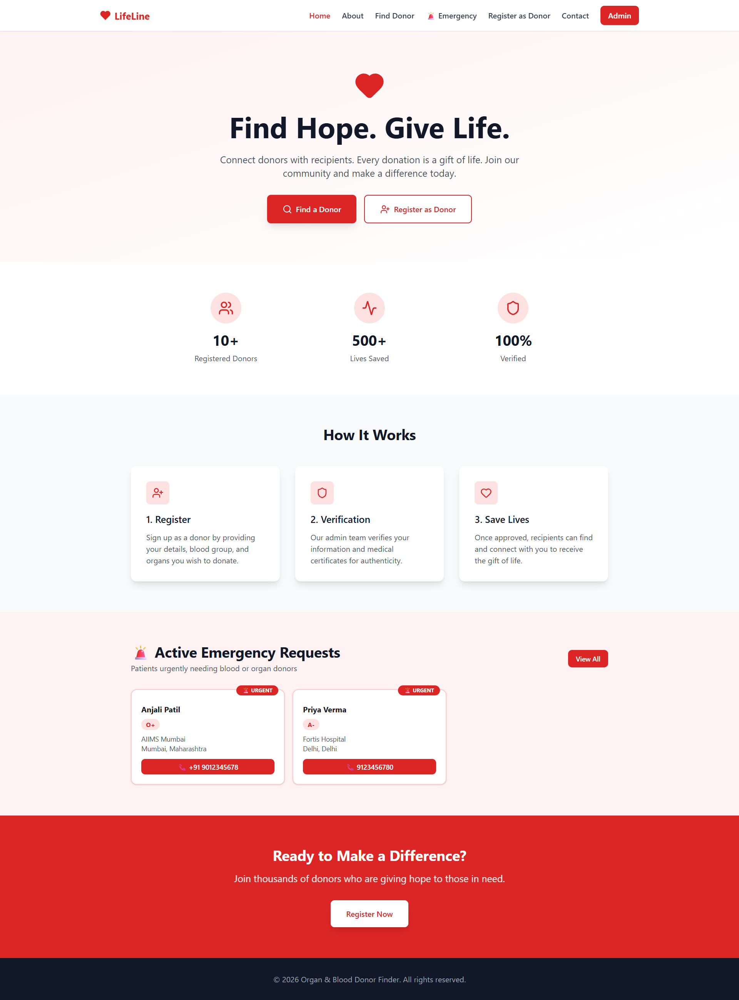
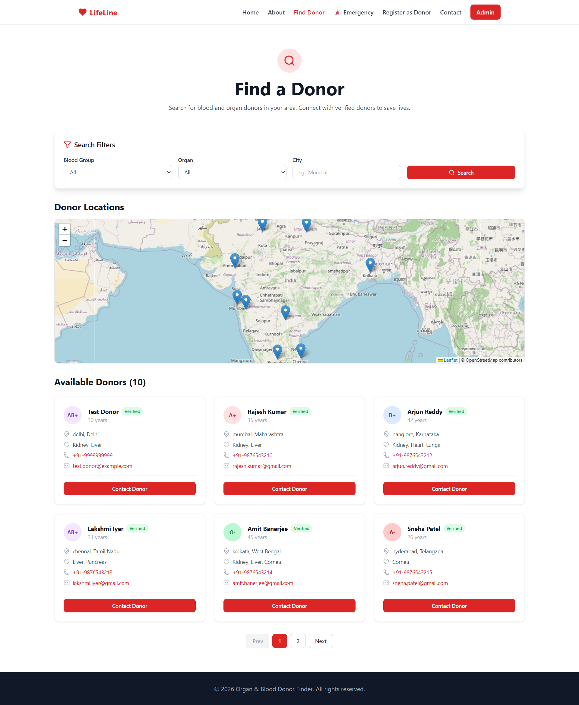
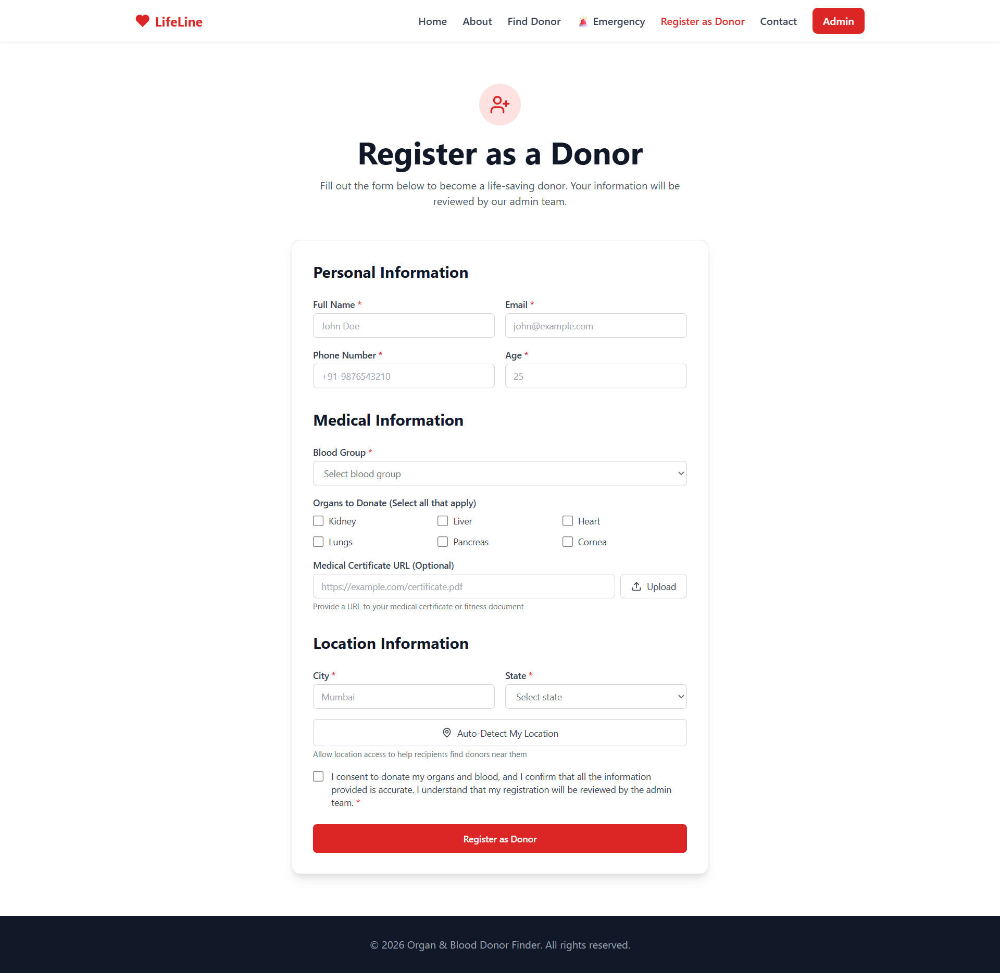
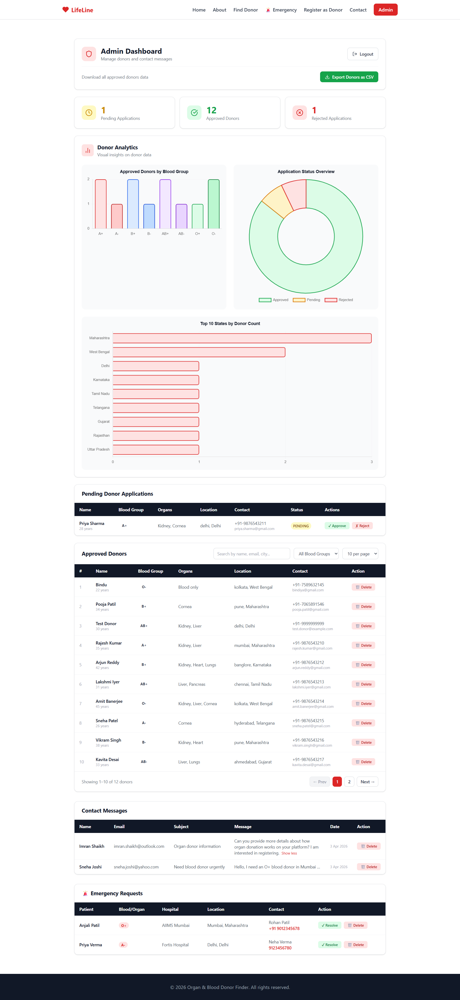
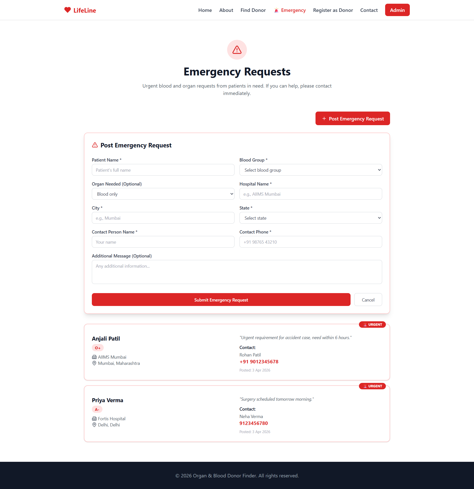

# 🩸 LifeLine — Blood & Organ Donor Finder

A full-stack MERN application that connects blood and organ donors with recipients. Built with MongoDB, Express.js, vanilla JavaScript, and Node.js.

🌐 **Live Demo:** [Coming Soon]

---

## 📸 Screenshots

### Home Page


### Find Donor


### Register as Donor


### Admin Dashboard


### Emergency Requests


---

## ✨ Features

### 👤 For Donors
- Register as a blood or organ donor
- Auto-detect location using browser geolocation
- Upload medical certificate URL
- Consent-based registration

### 🔍 For Recipients
- Search donors by blood group, organ and city
- Interactive Leaflet map showing donor locations
- Pagination — 6 donors per page
- Verified badge on all approved donors
- Emergency request system for urgent needs

### 🛡️ Admin Dashboard
- Secure JWT-based admin login
- Approve / Reject donor applications
- Delete approved donors
- Search + filter + pagination on donor table
- Export all donors as CSV
- View and delete contact messages
- Manage emergency requests
- Analytics charts (blood group distribution, application status, donors by state)
- Live donor count

### 🚨 Emergency System
- Post urgent blood/organ requests
- Visible on home page and emergency page
- Admin can resolve or delete requests

---

## 🛠️ Tech Stack

### Backend
| Technology | Purpose |
|---|---|
| Node.js | Runtime environment |
| Express.js | Web framework |
| MongoDB | NoSQL database |
| Mongoose | ODM for MongoDB |
| JWT | Admin authentication |
| bcryptjs | Password hashing |
| dotenv | Environment variables |
| cors | Cross-origin requests |

### Frontend
| Technology | Purpose |
|---|---|
| HTML5 | Structure |
| Tailwind CSS (CDN) | Styling |
| Vanilla JavaScript | Interactivity |
| Leaflet.js | Interactive maps |
| Lucide Icons | Icon library |
| Chart.js | Analytics charts |

---

## 📁 Project Structure
```
LifeLine/
|-- backend/
|   |-- config/
|   |   └── db.js               # MongoDB connection
|   |-- middleware/
|   |   └── auth.js             # JWT auth middleware
|   |-- models/
|   |   |-- Donor.js            # Donor schema
|   |   |-- Contact.js          # Contact form schema
|   |   └── EmergencyRequest.js # Emergency request schema
|   |-- routes/
|   |   |-- donors.js           # Donor CRUD + filters + export
|   |   |-- admin.js            # Admin login
|   |   |-- contacts.js         # Contact form
|   |   └── emergency.js        # Emergency requests
|   |-- .env                    # Environment variables
|   └── server.js               # Express server
|-- frontend/
|   |-- css/
|   |   └── style.css           # Global styles
|   |-- js/
|   |   └── shared.js           # Shared components
|   |-- pages/
|   |   |-- about.html          # About page
|   |   |-- find-donor.html     # Find donor + map
|   |   |-- register.html       # Donor registration
|   |   |-- contact.html        # Contact form
|   |   |-- admin.html          # Admin dashboard
|   |   └── emergency.html      # Emergency requests
|   └── index.html              # Home page
```


---

## ⚙️ Setup Instructions

### Prerequisites
- Node.js (v18+)
- MongoDB (local or Atlas)
- Git

### 1. Clone the repository
```bash
git clone https://github.com/PrajyotVijay/LifeLine.git
cd LifeLine
```

### 2. Setup Backend
```bash
cd backend
npm install
```

### 3. Create `.env` file in `backend/`
```env
PORT=5000
MONGO_URI=mongodb://localhost:27017/lifeline
JWT_SECRET=your_own_secret_key_here
ADMIN_USERNAME=your_username
ADMIN_PASSWORD=your_password
```

### 4. Start Backend
```bash
npm run dev
```

Backend runs on `http://localhost:5000`

### 5. Start Frontend
Open `frontend/index.html` with **Live Server** in VS Code

Or open directly in browser:

---

```markdown
## 🔐 Admin Access
Set your admin credentials in the `.env` file:
- `ADMIN_USERNAME` — your chosen username
- `ADMIN_PASSWORD` — your chosen password
```


---

## 🗺️ API Endpoints

### Donors
| Method | Endpoint | Description | Auth |
|---|---|---|---|
| GET | `/api/donors` | Get approved donors (with filters) | ❌ |
| GET | `/api/donors/count` | Get total approved donor count | ❌ |
| GET | `/api/donors/pending` | Get pending donors | ✅ |
| GET | `/api/donors/stats` | Get donor statistics | ✅ |
| GET | `/api/donors/export` | Export donors as CSV | ✅ |
| POST | `/api/donors` | Register new donor | ❌ |
| PATCH | `/api/donors/:id` | Approve/Reject donor | ✅ |
| DELETE | `/api/donors/:id` | Delete donor | ✅ |

### Admin
| Method | Endpoint | Description | Auth |
|---|---|---|---|
| POST | `/api/admin/login` | Admin login → returns JWT | ❌ |

### Contacts
| Method | Endpoint | Description | Auth |
|---|---|---|---|
| POST | `/api/contacts` | Submit contact form | ❌ |
| GET | `/api/contacts` | Get all messages | ✅ |
| DELETE | `/api/contacts/:id` | Delete message | ✅ |

### Emergency
| Method | Endpoint | Description | Auth |
|---|---|---|---|
| GET | `/api/emergency` | Get active requests | ❌ |
| POST | `/api/emergency` | Post emergency request | ❌ |
| PATCH | `/api/emergency/:id` | Mark as resolved | ✅ |
| DELETE | `/api/emergency/:id` | Delete request | ✅ |

---

## 👨‍💻 Author

**Prajyot Vijay Surwade**
- 🎓 BE Information Technology — Savitribai Phule Pune University (SPPU)
- 🎓 BS Data Science & AI/ML — IIT Madras
- 💼 [LinkedIn](https://www.linkedin.com/in/prajyot-surwade-80b1933b2/)
- 🐙 [GitHub](https://github.com/PrajyotVijay)


This project was independently developed by me as part of the SPPU Community Engagement Project curriculum.
---

## 📄 License

This project was developed as part of the **Community Engagement Project** submitted to **Savitribai Phule Pune University (SPPU)** under the BE Information Technology program. 

It is also showcased as a personal portfolio project to demonstrate full-stack development skills using the MERN stack.

Not intended for commercial use.


---

⭐ **If you found this project helpful, please give it a star!**